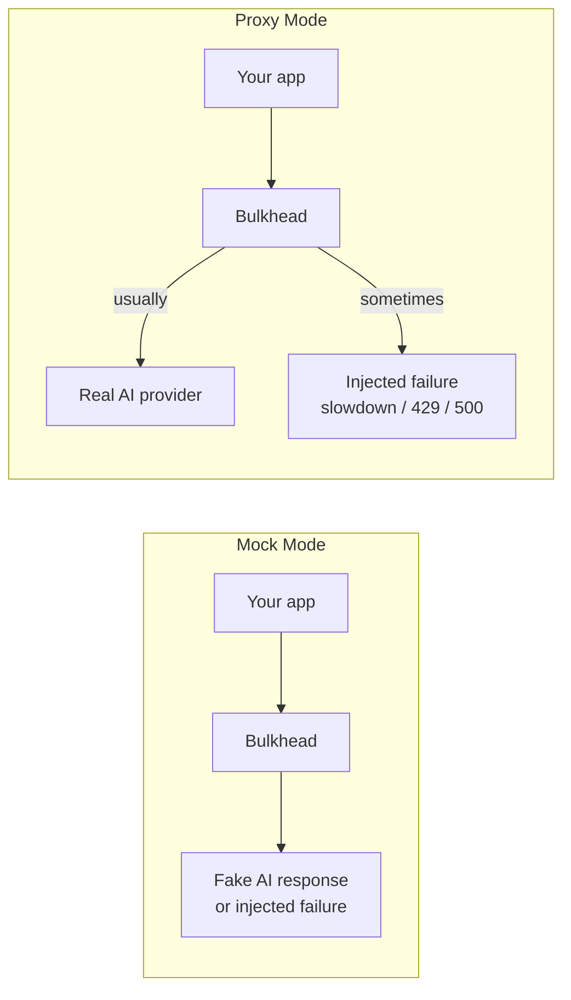

# Bulkhead

Bulkhead helps you test what your app does when an AI provider is slow, flaky, or down.

In simple terms:

- put Bulkhead between your app and OpenAI-compatible APIs
- tell Bulkhead to randomly fail some requests, slow some down, or return rate limits
- see whether your app retries, falls back, or breaks

This is useful because provider outages are normal, not rare.



As of March 15, 2026, the public status pages showed:

- OpenAI APIs: `99.08%` uptime over the last 90 days, with `67` listed incidents on the current history page
- Anthropic Claude API: `99.4%` uptime over the last 90 days, with `106` incidents listed across January-March 2026 on the current history page

That is the reason this tool exists: you should be able to test outages before your users find them for you.

Think of Bulkhead as Toxiproxy for AI: instead of generic TCP toxics, it injects OpenAI-style API failures, latency, and weighted fault scenarios into LLM traffic so you can test retries, fallbacks, and resilience logic.

Bulkhead can run in two modes:

- `proxy`: send requests to the real provider, but occasionally simulate failures on the way
- `mock`: do not call a real provider; return a tiny fake response unless a failure is injected

When you stop it, Bulkhead prints a simple scorecard showing how your app handled those failures.

## Quick Start

Fastest way to try it, with no real provider needed:

```bash
pip install -e .
bulkhead start --mode mock --scenario mixed-transient --fail-rate 0.2
```

Then point your app at Bulkhead instead of directly at OpenAI:

```bash
export OPENAI_BASE_URL=http://localhost:5000/v1
```

## Install

```bash
pip install -e .
```

Run it with:

```bash
bulkhead start --mode mock --scenario mixed-transient --fail-rate 0.2
```

## Codex Skill

This repo does not currently include a Codex `SKILL.md`.

So today, the way to use Bulkhead is:

1. install the package locally with `pip install -e .`
2. start Bulkhead with `bulkhead start ...`
3. point your app or the included examples at `http://localhost:5000/v1`

Example:

```bash
bulkhead start --config config.yaml
```

Then in another terminal:

```bash
cd examples/simple_langchain
pip install -r requirements.txt
OPENAI_API_KEY=dummy OPENAI_BASE_URL=http://localhost:5000/v1 python main.py
```

If you want this repo to be installable as a real Codex skill, the next step is to add a `SKILL.md` that explains when to use Bulkhead and the commands to run. That file does not exist yet.

## Config

Bulkhead will automatically load `config.yaml` from the current directory if it exists.

You can also pass a custom file:

```bash
bulkhead start --config bulkhead.yaml
```

CLI flags override YAML values.

You can also set `request_count` in `config.yaml` for the included example apps. They will send that many requests to Bulkhead unless `BULKHEAD_REQUEST_COUNT` is set.

Quick start:

```bash
cp config.example.yaml config.yaml
bulkhead start
```

See [config.example.yaml](/Users/saikrishna/tfy/bulkhead/config.example.yaml).

## Real Provider Mode

```bash
bulkhead start --mode proxy --upstream-url https://api.openai.com --scenario mixed-transient --fail-rate 0.2
```

This forwards traffic to the real provider, but injects failures along the way.

Point your app at Bulkhead:

```bash
export OPENAI_BASE_URL=http://localhost:5000/v1
```

## Fake Provider Mode

```bash
bulkhead start --mode mock --scenario mixed-transient --fail-rate 0.2
```

This never calls a real provider. It is useful for local testing, demos, and retry logic checks.

For SDKs that require an API key even in mock mode, use any dummy value:

```bash
export OPENAI_API_KEY=dummy
```

## Exact Failure Mix

If you want a very specific test, you can choose the exact mix of failures:

```bash
bulkhead start --mode proxy --upstream-url https://api.openai.com --faults 500=0.30,429=0.45
```

That means:

- `30%` of requests get `500`
- `45%` of requests get `429`
- the rest pass through normally

Bulkhead currently:

- handles `POST /v1/chat/completions`
- can inject `400, 401, 403, 404, 413, 429, 500, 503`
- can inject latency
- tracks duplicate requests
- prints a resilience scorecard on shutdown

```bash
curl http://localhost:5000/_bulkhead/scorecard
curl http://localhost:5000/_bulkhead/requests
```

## Scenarios

- `mixed-transient`
- `rate-limited`
- `provider-flaky`
- `non-retryable`
- `brownout`

## Examples

Run the simple LangChain example:

```bash
cd examples/simple_langchain
pip install -r requirements.txt
OPENAI_API_KEY=dummy OPENAI_BASE_URL=http://localhost:5000/v1 python main.py
```

More examples: [examples/README.md](/Users/saikrishna/tfy/bulkhead/examples/README.md).

## Codex Skill

A minimal repo-local skill is included at [skills/bulkhead-testing/SKILL.md](/Users/saikrishna/tfy/bulkhead/skills/bulkhead-testing/SKILL.md) for running Bulkhead in `mock` or `proxy` mode, executing a target app, and checking the scorecard endpoints.
